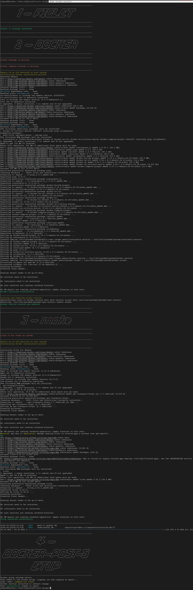
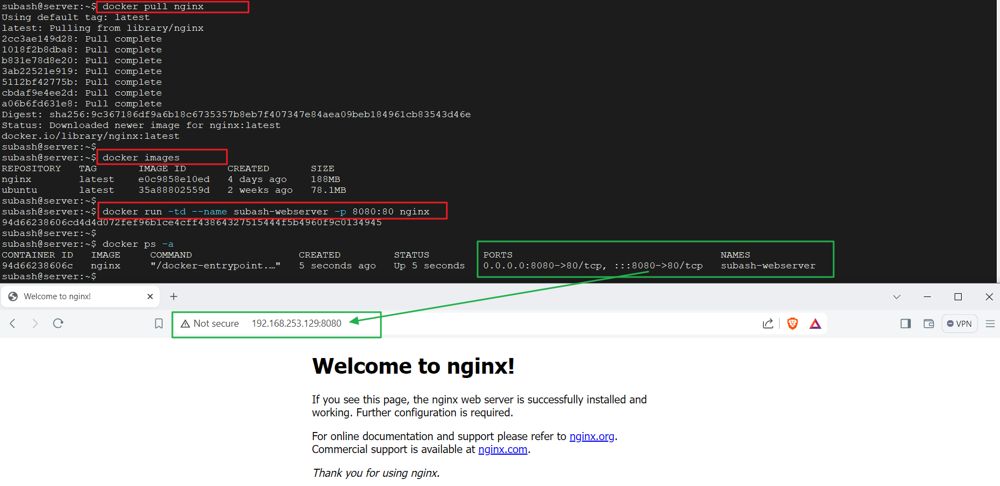

# Docummentation for deploying multiple tools

A brief description of what this project does and who it's for

- [Docummentation for deploying multiple tools](#docummentation-for-deploying-multiple-tools)
- [Authors](#authors)
- [1. Repo Description](#1-repo-description)
  - [2 Project Init](#2-project-init)
  - [2.1 Docker-setup](#21-docker-setup)
    - [2.1.1 Docker-installation](#211-docker-installation)
  - [Feedback and support](#feedback-and-support)


# Authors

- [@subash729subashglobalyhub](https://github.com/subashglobalyhub)


# 1. Repo Description

- Light/dark mode toggle
- Live previews
- Fullscreen mode
- Cross platform

## 2 Project Init
```bash
# clonning and setupping the into local system
git clone https://github.com/subashglobalyhub/tools-setup.git
cd tools-setup
chmod +x initial-setup.sh
./initial-setup.sh
```

```

```
Test setup is working properly or not 
```bash
make 
or
make help
```

```

```

## 2.1 Docker-setup
```
docker images
```

### 2.1.1 Docker-installation
```
make docker-install
```


```
```
Now, testing docker is running properly or not.
```
# Checking some commands
docker version
docker pull ubuntu
docker images
docker run -td --name subash-webserver -p 8080:80 nginx
```


## Feedback and support

If you have any feedback, please reach out to us at <br> 
**Mail:** subash.chaudhary@globalyhub.com <br>
**Phone:** +977 9823827047 <br>


